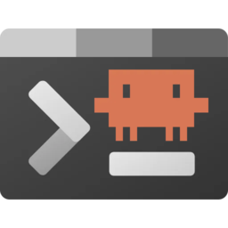
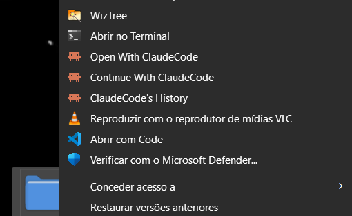

# ClaudeHere

**Open Claude Code or OpenClaude straight from any folder in Windows. No terminal, no typing commands by hand.**

## Features

- **Adds Claude Code and OpenClaude to the right-click context menu of any Windows folder** — open, continue, or resume history where you actually are.
- **Two clicks, no terminal**: go from right-click to a working Claude session in seconds.
- **Optional "dangerously skip permissions" entries** (`--dangerously-skip-permissions`) for frictionless, one-click runs.
- **Bilingual UI**: English or Portuguese (`pt-br`).
- **Pick the icon**: the official Claude Code or OpenClaude logo in your menu.
- **Clean remove**: one click deletes every menu entry and icon from the Windows registry.

## The problem

Claude Code and OpenClaude are CLI tools, which means the usual ritual: **open a terminal, navigate to the folder, type the command**. Fine once. Annoying fast when you do it several times a day across different projects. The same song and dance every single time.

## The idea

ClaudeHere is a small app that drops both CLIs right into the **right-click menu of any folder on Windows**. Install it once, and the next time you need Claude in a specific directory you just right click, pick the option, and you are in. **Two clicks.** That is the whole difference.

## What appears in the Windows right-click menu

Depending on what you chose during setup, right clicking a folder can show any of these:

- **Open with**: starts Claude Code or OpenClaude in that folder.
- **Continue with**: jumps back into your last conversation there.
- **History**: lists past sessions so you can pick one to resume.
- The same three again with **"dangerously skip permissions"**, for the days you do not want to confirm every single action.

You choose which ones show up. No bloat, just the entries you actually use.

## The interface

Everything fits in a single small window:

- **Language**: `English` or `Portuguese`.
- **Platform**: `Claude Code` or `OpenClaude`.
- **Logo**: which icon the menu shows, whichever you prefer out of the two official ones.
- **Options**: tick the ones you want.
- **Install and Remove**: Remove stays grayed out until something is installed, so there is no risk of clicking it by accident.

A status line at the bottom tells you whether it worked or what went wrong, so you are never left guessing.

Hit **Install** and the menu entries appear right away. Changed your mind later? Open the app, hit **Remove**, and everything goes away, icon included.

## Requirements & Development

- **Windows only**, and installing requires administrator rights.
- Run it in development with `python main.py`.
- Build a standalone executable with `pyinstaller main.spec`.